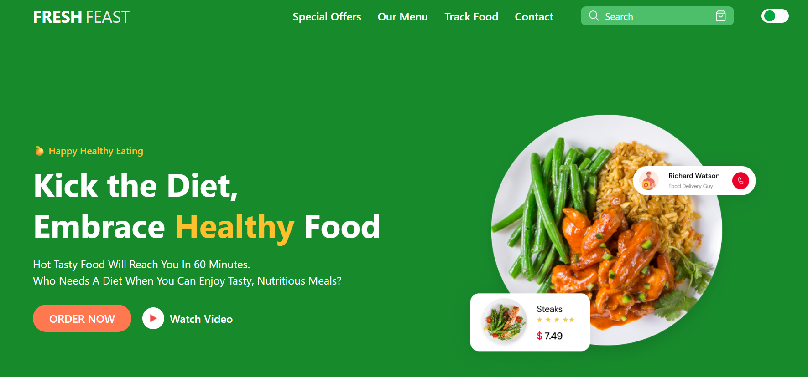

# 🥗 Fresh Feast

**Fresh Feast** is a modern and responsive food delivery landing page focused on promoting healthy eating with speed and simplicity. It offers a clean UI, dark mode toggle, and seamless experience across all devices.

---

## 🚀 Features

- 🌙 Dark & Light mode toggle
- 📱 Fully responsive on all screen sizes
- 🧾 Organized menu with product cards
- 📦 Add-to-cart buttons (UI only)
- 🧑‍🍳 Chef highlight & testimonials
- 📲 App download promotion
- 📬 Newsletter subscription with email input
- ⚡ Smooth scrolling navigation

---

## 🛠️ Built With

- **HTML5**
- **Tailwind CSS**
- **Vanilla JavaScript**
- **Font Awesome**

---

## 🌐 Live Preview

🔗 [View Live Site](https://fresh-feast-black.vercel.app/)  
📷 Screenshot Preview below ↓

---

## 📸 UI Preview

---

## 👨‍💻 Developer

**Mehedi Hasan Rabbi**  
Front-End Web Developer | 🇸🇦 Saudi Arabia  
🌐 [Github](https://github.com/mehedihasanrabbivip)

---

## 📄 License

This project is for personal, educational, and portfolio use only.  
Feel free to customize with proper credits.

